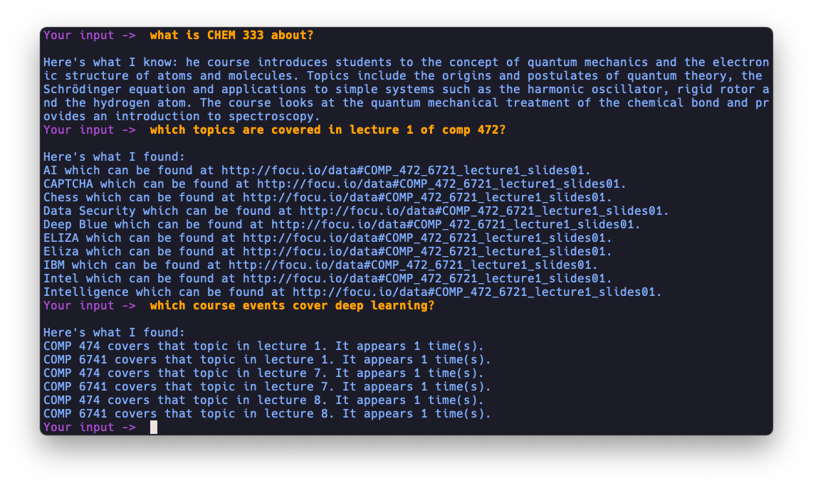

<div>
  <h2 align="center">Roboprof</h2>
  <p align="center">
      An intelligent agent designed to answer questions related to university courses and students by leveraging a knowledge graph and NLP techniques in Python.
  </p>
  <p align="center">
    
  </p>
</div>


## Getting Started

### Initial Setup
1. Ensure you have python 3.10 installed on your computer
2. Ensure you have Poetry installed on your computer.
3. Clone the repository and navigate to the project directory.
4. Run the following commands to set up the environment:
   ```
   poetry install
   poetry shell
   python -m spacy download en_core_web_sm
   ```

### Process flow:

#### Set up Fuseki Server
- Run the Fuseki server via:
  ```
  python main.py start_fuseki
  ```
  or follow the detailed setup instructions in the SPARQL server setup section below.

#### Generate Graph Output Files
- Ensure correct file structure as specified in the GitHub repository to avoid errors.
- Download `CATALOG.csv` and `CU_SR_OPEN_DATA_CATALOG.csv` from:
  ```
  https://opendata.concordia.ca/datasets/
  ```
- Generate graph output by running:
  ```
  python main.py build_graph
  ```

#### Upload TTL Files to SPARQL Database
- Confirm that the Fuseki server is active at localhost:3030, and that you have the file output/turtles.ttl
- Execute:
  ```
  python main.py setup_database
  ```
  or simply:
  ```
  python main.py
  ```

### Development Guidelines
- Add new packages via:
  ```
  poetry add <package_name>
  ```
- Keep this README updated with any significant changes.

## Project Organization

### Directories
- `data`: Holds datasets from Concordia (downloadable [here](https://opendata.concordia.ca/datasets/)), and CSVs for student and course data.
- `content`: Contains lecture materials for selected courses.
- `queries`: Stores SPARQL queries and their results from project part 1.
- `queries2`: Contains additional SPARQL queries for project part 2.
- `rasa`: Includes all Rasa related files for the chatbot implementation.

### Scripts Overview
- `academic_builder.py`: Parses academic-related CSVs and builds RDF triples.
- `content_builder.py`: Parses educational content for RDF graph construction.
- `course_builder.py`: Handles the parsing of Concordia University's course catalogs.
- `graph_builder.py`: Consolidates graphs from various parsers into a unified RDF graph.
- `topic_processor.py`: Implements named entity recognition and linking to Wikidata.
- `constants.py`: Maintains consistent URIs across scripts.
- `helpers.py`: Provides reusable utility functions.
- `sparql_fuseki_manager.py`: Manages connection and creation to the Fuseki SPARQL server.
- `sparql_query_manager.py`: Stores queries and parsing logic for each rasa action.
- `main.py`: Central script initiating the Fuseki server, graph building, and database setup.

### SPARQL Server Setup
on Mac:
- Install Apache Jena Fuseki via Homebrew: `brew install fuseki`.
- Verify installation with `fuseki-server --version`.
- Start the server using `fuseki-server` and access it at `http://localhost:3030/`.
- Upload ttl/nt files and execute SPARQL queries through the Fuseki interface.

on Windows:
- Download and extract `apache-jena-fuseki-5.0.0-rc1.zip` from the [Apache Jena website](https://jena.apache.org/download/).
- Use Command Prompt to navigate to the extracted folder and verify installation with `fuseki-server.bat --version`.
- Start the server using `fuseki-server.bat` and access it at `http://localhost:3030/`.
- Upload ttl/nt files and execute SPARQL queries through the Fuseki interface.

### Rasa Setup
- Ensure Python version is 3.10.
- Navigate to the `rasa` directory.
- Train the Rasa model with `rasa train`.
- Start the actions server with `rasa run actions`.
- In a different terminal: Interact with the trained model using `rasa shell`.

This setup trains the Rasa model, runs the actions server, and opens a shell for interaction.